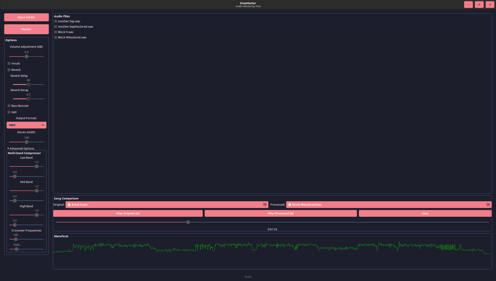

# SlopMaster

SlopMaster is a C program that processes audio files using [FFmpeg](https://ffmpeg.org/), applying various audio filters for mastering. It now supports multi-threading for faster processing and allows users to specify the output format. SlopMaster comes in two versions: a terminal-based application (slopTerminal) and a GUI version (slopGUI).

## About FFmpeg

This project relies heavily on [FFmpeg](https://ffmpeg.org/), a powerful multimedia framework. FFmpeg is an essential tool in the audio and video processing world, and it's what makes SlopMaster possible. 

**Please consider supporting FFmpeg:**
- Donate to FFmpeg: https://ffmpeg.org/donations.html
- Contribute code: https://ffmpeg.org/developer.html

Your support helps maintain and improve this crucial open-source project.

## Prerequisites
- GCC compiler
- [FFmpeg](https://ffmpeg.org/) 4.3 or later installed and accessible from the command line
- POSIX-compliant system (Linux, macOS, etc.)
- pthread library
- GTK3 development libraries (for slopGUI)

## Compilation

Compile slopTerminal using:
gcc -o slopTerminal slopTerminal.c -lpthread $(pkg-config --cflags --libs libavcodec libavformat libavutil libswresample) -lm

Compile slopGUI using:
gcc -o slopmaster slopGUI.c `pkg-config --cflags --libs gtk+-3.0 gstreamer-1.0 sndfile` -lm -lpthread

## Usage

### slopTerminal
./slopTerminal [options]
Options:
-i <input_dir>   Specify input directory (default: current directory)
-o <output_dir>  Specify output directory (default: current directory)
-v               Enable vocal mode for processing songs with vocals
-f <format>      Specify output format (wav, flac, or mp3; default: wav)
-n               Enable verbose mode
-r               Enable reverb
-d <delay>       Set reverb delay (default: 60.0)
-e <decay>       Set reverb decay (default: 0.5)
-b               Enable bass boost
-w               Enable wet effect
-h               Display this help message

### slopGUI
Launch the GUI application: ./slopGUI

## Supported File Formats

SlopMaster supports processing the following audio file formats:
- WAV
- MP3
- AAC
- OGG
- FLAC

## How It Works

SlopMaster uses FFmpeg's powerful audio filtering capabilities to apply a series of audio processing steps:

1. Channel layout adjustment
2. High-pass and low-pass filtering
3. Noise reduction
4. Multi-band compression
5. Equalization
6. Compression
7. Stereo enhancement
8. Loudness normalization
9. Limiting
10. Volume adjustment

Additional processing options include:
- Vocal-specific processing
- Reverb
- Bass boost
- Wet effect

## Output

Processed files are saved in the specified format (WAV, FLAC, or MP3) with the following specifications:
- Sample rate: 48000 Hz
- Bit depth: 24-bit (for WAV and FLAC)

## License

This project is licensed under the MIT License - see the LICENSE file for details.

## Contributing

Contributions are welcome! Please feel free to submit a Pull Request.

## Acknowledgements

This project would not be possible without [FFmpeg](https://ffmpeg.org/). We encourage users to support FFmpeg through donations or code contributions.
